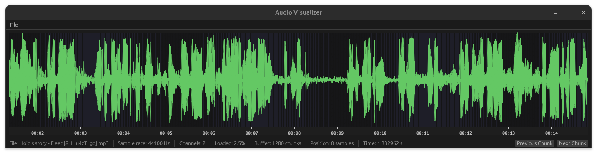

# Audio Visualizer 🎵

A modern, high-performance audio waveform visualizer built in Rust. See your music like never before!
Still work in progress!



## Features 🔊

- **Multi-format support**: Load and visualize WAV, MP3, FLAC, AAC, and OGG audio files
- **Efficient memory management**: Chunk-based loading lets you work with even massive audio files without slowdowns
- **High-precision timing**: Fixed-point arithmetic ensures sample-accurate time representation
- **Interactive navigation**:
  - Zoom in/out with Alt+Scroll to see the details or the big picture
  - Easily navigate through your audio with the scroll wheel
  - Clear time markers help you find exactly what you're looking for
- **Beautiful visualization**: Color-coded waveform display with chunk boundaries makes patterns easy to spot
- **Responsive UI**: Built with the ergonomic egui framework for a snappy experience

## Installation

### Prerequisites

- Rust (1.74 or newer recommended)
- Cargo package manager

### Building from source

1. Clone the repository:
   ```bash
   git clone https://github.com/yourusername/audio-visualizer.git
   cd audio-visualizer
   ```

2. Build the project:
   ```bash
   cargo build --release
   ```

3. Run the application:
   ```bash
   cargo run --release
   ```

## Usage 🖱️

Getting started is super easy:

1. Launch the application
2. Click on "File" → "Open..." to select an audio file
3. Use the mouse wheel to navigate through the audio
4. Hold Alt while scrolling to zoom in and out
5. Keep an eye on the status bar for your current position and loading status

### Keyboard Shortcuts

- **Alt + Scroll**: Zoom in/out
- **Scroll**: Navigate through the audio timeline

## Technical Details

The visualizer uses a smart chunk-based approach that makes it incredibly efficient:

- Audio is loaded in manageable chunks of 1024 samples
- Only the chunks you actually need are kept in memory
- The app automatically loads/unloads chunks as you navigate
- High-precision fixed-point arithmetic ensures you get sample-accurate timing

## Dependencies

- **eframe/egui**: Sleek GUI framework
- **symphonia**: Powerful audio decoding for multiple formats
- **fixed**: Rock-solid fixed-point arithmetic
- **rustfft**: Lightning-fast Fourier Transform capabilities
- **ringbuf**: Super efficient ringbuffer implementation
- **rfd**: Native file dialogs that look right at home on your OS

## License

This project is licensed under the MIT License - see the LICENSE file for details.

## Acknowledgments

- [egui](https://github.com/emilk/egui) for the excellent immediate mode GUI framework
- [symphonia](https://github.com/pdeljanov/Symphonia) for the powerful audio decoding capabilities